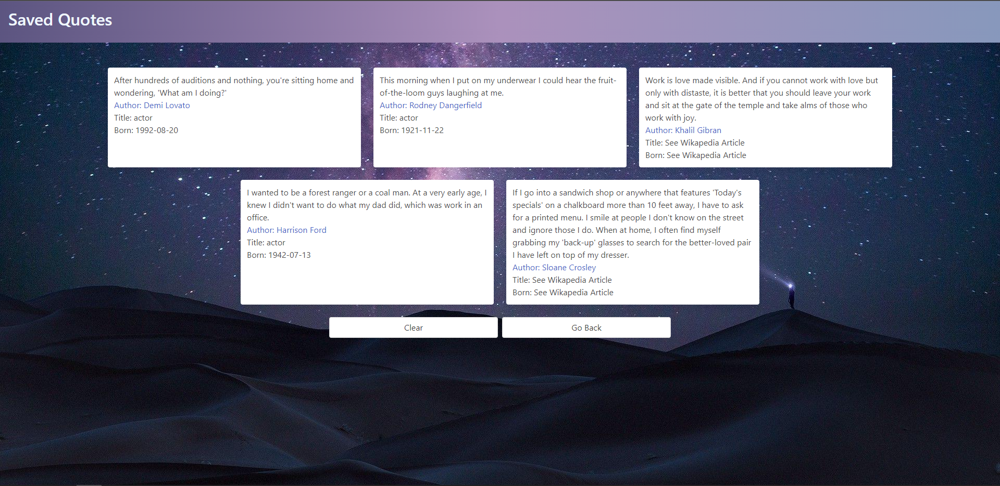

# Random Quote Generator 
=======
## Project Title

Random Quote Generator; Save your favorite quote & learn more about the author!

## Table of Contents

- [Project Description](#project-description)
- [Technologies Used](#technologies-used)
- [Screenshots](#screenshots)
- [Deployed Webpage](#deployed-webpage)
- [Repository](#repository)

## Project Description

AS a user
I WANT to be presented with random quotes and the author who wrote them as well as information about the author.
SO THAT I can compile a list of my favorite quotes and revisit them, and have the ability to learn more about the author.

GIVEN I want to access a random quote and the name of the author of that quote as well as learn more about that author.
WHEN I click a button
THEN I am provided with a random quote, the author who wrote it and have the ability to learn more about that author.

A function called getAuthor uses a click event listener allowing the user to interact with the "Get Quote" button that then uses a fetch function to call the quote API. Using the function random_category to randomize the category query in the API URL the fetch function returns a quote from a randomly selected accepted category. The quote from this object is then selected and displayed on the page and the author data is then turned into a wikipedia link based on the name of the author and displayed on the page.

WHEN I find a quote or Author that I would like to revisit
THEN I am able to save that quote to my client-side storage and revisit it at a later date.

Inside the getAuthor function when the quote is generated a button is also generated that allows the user to interact with it using a click event listener. The event listener targets the authorInfo function which uses the authors name as a query to call a fetch function on the celebrity API and uses that data to generate two facts and calls the savequote function. If the celebrity API is undefined the fetch function is called on the historical figures API and uses that data to generate two facts and calls the savequote function. If the historical figures API is undefied then the message "See Wikapedia Article" is displayed and the savequote function is called. The save quote function stores that information in local storage as an object at a specific key and then sets it as a string and stores it in an array.

WHEN I save a quote to client side storage
THEN I am notified that my quote has been saved

The "Save Quote" button usses the js-modal-trigger class attached to a click function to access the third party model to display the message "You saved a quote!"

WHEN I want to revisit the quotes
THEN I am able to view a list of all the quotes I have saved with facts about the authors date of birth and occupation, as well as a link to learn more about the author.

The index.html has a button link to quotes.html which uses the printQuotes function which pulls the stored strings at each array index of the "SavedQuotes" quotes array. Creates a division and paragraph elements for each item in the array and displays them on the page. It also uses the authors name to provide a link to the Wikipedia page about the author.

WHEN I want to get rid of my saved quotes
THEN I have the ability to clear out my quotes to make room for more

The clearHistory function uses the remove item method on local storage to remove the "SavedQuotes" array and refreshes the page using location.reload().

## Technologies Used

Project was created with:

    

## Screenshots

S

## Deployed Webpage

https://r-warden.github.io/Quote-Generator/

## Repository

https://github.com/r-warden/Quote-Generator
